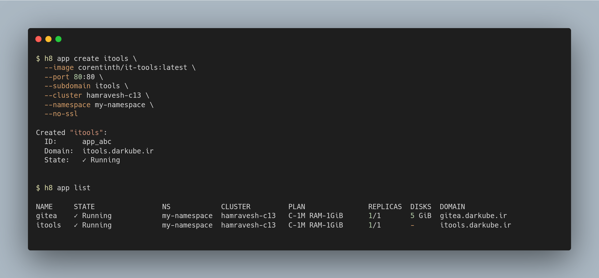

# h8 — Hamravesh CLI

Command-line interface for [Hamravesh](https://hamravesh.com), the Iranian cloud platform.

[](https://github.com/erfanium/h8-cli)


## Install

Requires Node.js >= 22 and [kubectl](https://kubernetes.io/docs/tasks/tools/) (for `h8 kubectl`).

### npm (global)

```bash
npm install -g @erfanium/h8-cli
h8 --help
```

### npx (no install)

```bash
npx @erfanium/h8-cli app list
```

### From source

```bash
git clone https://github.com/erfanium/h8-cli.git
cd cli
npm install
npm run build
npm link
h8 --help
```

## Uninstall

```bash
npm uninstall -g @erfanium/h8-cli
```

## Setup

```bash
export H8_API_KEY=your-api-key
export H8_ORGANIZATION=your-org

# or persist to disk
h8 login <api-key> --org <name>

# verify
h8 app list
```

Get an API key from the [Hamravesh Console](https://console.hamravesh.com) under your account settings.

## Quick Start

Deploy [IT-Tools](https://it-tools.tech) — 50+ developer utilities in one page:

```bash
# see what's available
h8 cluster list
h8 namespace list

# deploy
h8 app create itools \
  --image corentinth/it-tools:latest \
  --port 80:80 \
  --subdomain itools \
  --cluster hamravesh-c13 \
  --namespace my-namespace \
  --no-ssl

# wait a few seconds, then verify
h8 app list
h8 app describe itools
h8 app pods itools
h8 app logs itools

# it's live at https://itools.darkube.ir
```

Add a disk, change envs, scale up:

```bash
h8 set disk itools 5 /data
h8 set env itools DEBUG=true
h8 set replicas itools 2
```

Tear it down:

```bash
h8 app delete itools
```

## Commands

### Apps

```
h8 app list [--json] [--limit=N]        List apps (sorted by namespace)
h8 app describe <name|id> [--json]      Show app details
h8 app create <name> [flags]            Create a new app
h8 app restart <name>                   Restart an app
h8 app start <name>                     Start a stopped app
h8 app stop <name>                      Stop an app
h8 app delete <name>                    Delete an app
h8 app logs <name> [--tail=N] [--json]  View app logs
h8 app events <name> [--json]           Watch deployment events (WebSocket)
h8 app pods <name> [--json]             List running pods
h8 app exec <app> -- <command...>       Run a command inside a pod
h8 app shell <name>                     Open an interactive shell
```

### Mutations (kubectl-style set)

```
h8 set image <app> <repo>[:<tag>]       Change image
h8 set replicas <app> <count>           Scale replicas
h8 set env <app> KEY=VALUE [...]        Set environment variables
h8 set disk <app> <size> <path>         Attach persistent disk
```

### Infrastructure

```
h8 cluster list [--json]                List available clusters
h8 namespace list [--json]              List namespaces
```

### Builds & Contexts

```
h8 build list <app> [--json]            List builds for an app
h8 build logs <build-id> [--json]       Show build details
h8 context list [--json]                List deploy contexts
h8 context describe <name> [--json]     Show context details
```

### kubectl

```
h8 login kubectl [--email X] [--password Y]   Get a k8s OIDC token
                                              (saved to ~/.config/h8/kubectl.json)

h8 kubectl get pods                            Run kubectl commands
h8 kubectl describe pod <name>
h8 kubectl logs <pod-name>
h8 kubectl get svc
```

`h8 kubectl` fetches a kubeconfig from the API, injects your token, and passes all remaining arguments to the real `kubectl` binary. No files are written to `~/.kube` — fully stateless.

Kubectl tokens are stored per-organization in `~/.config/h8/kubectl.json` and automatically refreshed when needed.

## JSON Output

Append `--json` to any command for machine-readable output:

```bash
h8 app list --json
h8 app describe my-app --json
h8 app events my-app --json
```

## Environment Variables

| Variable | Description |
|---|---|
| `H8_API_KEY` | Hamravesh API key |
| `H8_ORGANIZATION` | Organization name |
| `H8_ALLOW_DESTRUCTIVE` | Set `true` to enable delete/stop/restart |

## License

MIT
